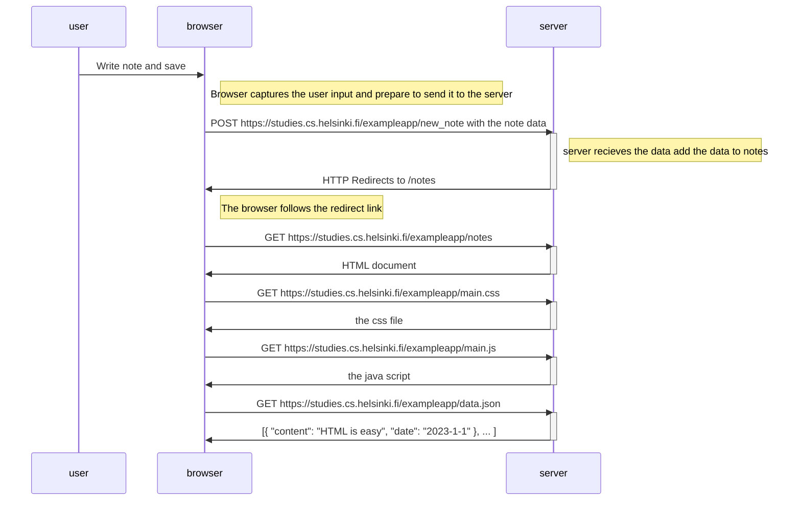

```mermaid
sequenceDiagram

    participant user
    participant browser
    participant server

    user->>browser: Write note and save
    Note right of browser: Browser captures the user input and prepare to send it to the server

    browser->>server: POST https://studies.cs.helsinki.fi/exampleapp/new_note with the note data
    activate server
    Note right of server: server recieves the data add the data to notes
    server->>browser: HTTP Redirects to /notes
    deactivate server

    Note right of browser: The browser follows the redirect link

    browser->>server: GET https://studies.cs.helsinki.fi/exampleapp/notes 
    activate server
    server->>browser: HTML document
    deactivate server

    browser->>server: GET https://studies.cs.helsinki.fi/exampleapp/main.css 
    activate server
    server->>browser: the css file
    deactivate server

    browser->>server: GET https://studies.cs.helsinki.fi/exampleapp/main.js
    activate server
    server->>browser: the java script
    deactivate server

    browser->>server: GET https://studies.cs.helsinki.fi/exampleapp/data.json 
    activate server
    server->>browser: [{ "content": "HTML is easy", "date": "2023-1-1" }, ... ]
    deactivate server

```