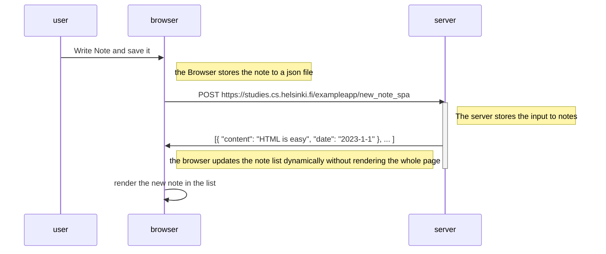

```mermaid
sequenceDiagram

    participant user
    participant browser
    participant server

    user->>browser: Write Note and save it
    Note right of browser: the Browser stores the note to a json file

    browser->>server: POST https://studies.cs.helsinki.fi/exampleapp/new_note_spa
    activate server
    Note right of server: The server stores the input to notes
    server->>browser: [{ "content": "HTML is easy", "date": "2023-1-1" }, ... ]
    Note right of browser: the browser updates the note list dynamically without rendering the whole page
    deactivate server

    browser->>browser: render the new note in the list


```